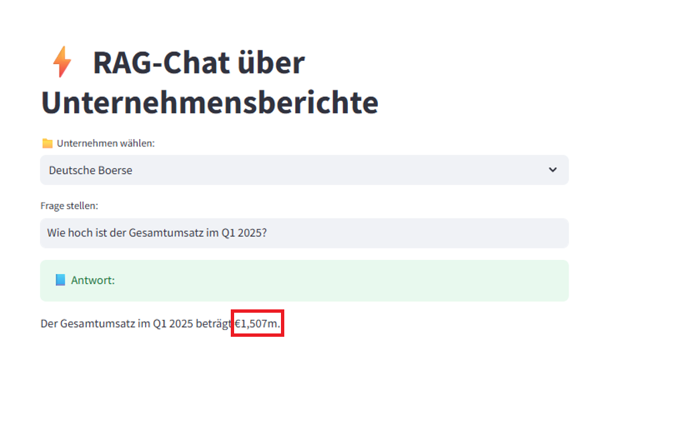
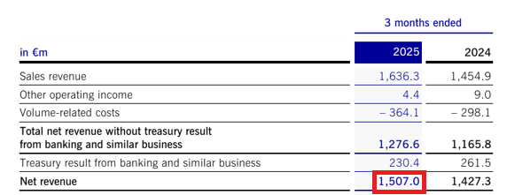

# Lokales RAG-ChatGPT für Unternehmensdokumente


Ein anpassbares, vollständig offline laufendes Frage-Antwort-System für unternehmensinterne Dokumente (z. B. Finanzberichte). Das Projekt basiert auf Retrieval-Augmented Generation (RAG), lokalen Embeddings und einem lokal laufenden Sprachmodell über Ollama.
    

## Projektmotivation


Unternehmen haben berechtigte Sorgen, wenn es um die Preisgabe sensibler Daten an externe Cloud-Dienste wie ChatGPT geht. Dieses Projekt demonstriert eine vollständig lokale Lösung für interaktive Dokumentenanalyse:

- Keine Datenübertragung an externe Server
- Kein API-Key notwendig
- Volle Kontrolle über Verarbeitung und Speicherung

Ziel ist es, eine dialogfähige Anwendung bereitzustellen, die interne Dokumente wie Finanzberichte analysieren und daraus Fragen beantworten kann.
    

## Funktionsumfang


- Verarbeitung von PDF-Dokumenten mit LangChain
- Erstellung semantischer Embeddings mit SentenceTransformer (MiniLM)
- Speicherung in einer lokalen Vektordatenbank (Chroma)
- Einsatz eines lokal laufenden LLMs via Ollama (z. B. Mistral)
- Optional: Bedienoberfläche mit Streamlit
    

## Einrichtung


1. Installiere die Abhängigkeiten aus `requirements.txt`:
```bash
pip install -r requirements.txt
```

2. Starte das lokale Sprachmodell mit Ollama:
```bash
ollama run mistral
```

3. Starte die Streamlit-Anwendung (optional):
```bash
streamlit run rag_chat_app_.py
```
    

## Beispielanfrage


**Frage:**  
Wie hoch ist der Gesamtumsatz im Q1 2025?

**Antwort des Systems:**  
Der Gesamtumsatz im Q1 2025 beträgt €1,507m.

**Antwort im UI:**  


**Fundstelle im PDF:**  


    

## Ergebnis


Dieses Projekt zeigt, dass moderne KI-Technologien wie RAG auch vollständig lokal und datenschutzkonform eingesetzt werden können. Die Anwendung eignet sich ideal für sensible Einsatzbereiche wie Personalwesen, Controlling oder strategische Analysen auf Basis interner Daten.
    

## Stichworte


Retrieval-Augmented Generation, LangChain, Ollama, PDF-Dokumentenanalyse, lokale KI, Datenschutz, Chroma, SentenceTransformer, Unternehmensdaten, Mistral
    
